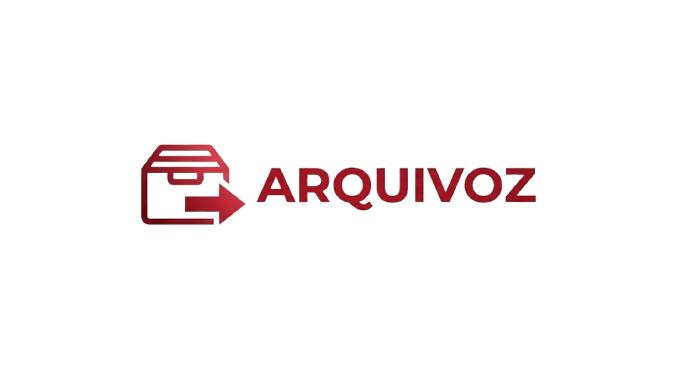

<div align="center">



# Arquivoz

**Gerencie, pesquise e converta seus PDFs com inteligência.**


</div>

---

## O que é o Arquivoz?

O **Arquivoz** é uma ferramenta desktop completa para profissionais que trabalham com grandes volumes de documentos PDF. Com uma interface moderna e intuitiva, ele permite buscar termos específicos, extrair páginas, unir arquivos e transformar documentos escaneados em PDFs totalmente pesquisáveis — tudo sem sair do computador e sem enviar nenhum dado para a internet.

> Processa tudo localmente. Seus documentos ficam com você.

---

## Funcionalidades

### Buscar e Extrair
Encontre termos em PDFs de texto nativo e extraia exatamente o que você precisa.

- Pesquise múltiplos termos simultaneamente em qualquer PDF
- Veja quais páginas contêm cada termo, com destaque visual
- Extraia um PDF separado por termo encontrado com um clique
- Gere relatórios de busca (encontrado / não encontrado) em `.txt`
- Progresso em tempo real, página a página

---

### Unir PDFs
Combine quantos arquivos quiser em um único documento organizado.

- Adicione quantos PDFs precisar à fila de mesclagem
- Reordene os arquivos com os botões **Acima** e **Abaixo**
- Remova itens individualmente ou limpe a fila de uma vez
- Acompanhe o progresso da mesclagem em tempo real
- Escolha o nome e o local do arquivo final

---

### Busca por OCR
Pesquise dentro de documentos **escaneados** usando reconhecimento óptico de caracteres.

- Suporte a PDFs digitalizados (imagens) via Tesseract OCR
- Idiomas disponíveis: **Português**, **Inglês** ou ambos
- Qualidade configurável: **150, 200 ou 300 DPI**
- Processamento paralelo com **1, 2, 4 ou 8 threads**
- **Cache inteligente**: documentos já processados são reutilizados instantaneamente
- Extração separada por termo ou mesclagem de todos os resultados em um único PDF
- Barra de progresso com velocidade e estimativa de conclusão (ETA)
- Botão de cancelamento disponível a qualquer momento

---

### Converter para Pesquisável
Transforme PDFs escaneados em documentos com camada de texto, mantendo o visual original.

- Processamento em lote: converta múltiplos PDFs de uma vez
- Camada de texto invisível inserida sobre as imagens (PDF/A-like)
- Opção de **mesclar todos os convertidos** em um único arquivo de saída
- Configuração de idioma, DPI e número de threads por conversão
- Duas barras de progresso: uma por arquivo, outra por página
- Resultados exibidos com status por arquivo (Aguardando / Convertendo / Concluído / Erro)
- Alertas automáticos se arquivos seriam sobrescritos

---

## Requisitos

| Componente | Versão mínima |
|---|---|
| Python | 3.10+ |
| Sistema Operacional | Windows 10/11 |
| Tesseract OCR | Qualquer (instalado pelo setup) |

### Dependências Python

| Pacote | Finalidade |
|---|---|
| `customtkinter` | Interface gráfica moderna |
| `pdfplumber` | Extração de texto nativo de PDFs |
| `pypdf` | Manipulação de páginas PDF |
| `Pillow` | Processamento de imagens |
| `pymupdf` | Renderização de PDFs para OCR |
| `pytesseract` | Interface Python com o Tesseract OCR |

> Todas as dependências são instaladas automaticamente pelo instalador.

---

## Download

<div align="center">

[](https://github.com/jdgoes/Arquivoz/releases/tag/Arquivoz-v.1.0)

**[→ github.com/jdgoes/Arquivoz/releases](https://github.com/jdgoes/Arquivoz/releases/tag/Arquivoz-v.1.0)**

Baixe o `ArquivozSetup.exe` na página de releases e siga o instalador.

</div>

---

## Instalação

### Opção 1 — Instalador gráfico (recomendado)

1. [Baixe o **ArquivozSetup.exe**](https://github.com/jdgoes/Arquivoz/releases/tag/Arquivoz-v.1.0) na página de releases
2. Certifique-se de ter o **Python 3.10+** instalado e no PATH
3. Execute o **`ArquivozSetup.exe`**
4. Na tela de boas-vindas, escolha a pasta de instalação (padrão: `AppData\Local\Arquivoz`)
4. Leia e aceite os **Termos de Uso**
5. Leia e aceite os **Termos de Uso**
6. Clique em **Aceitar e Instalar** — o instalador cuida do resto:
   - Copia os arquivos do app para a pasta escolhida
   - Instala todas as dependências Python via pip
   - Baixa e instala o **Tesseract OCR** automaticamente
   - Baixa os modelos de idioma (Português e Inglês)
   - Cria atalhos no **Desktop** e no **Menu Iniciar**
7. Ao final, clique em **Abrir Arquivoz** para começar a usar

### Opção 2 — Instalação manual

```bash
# Clone ou extraia os arquivos na pasta desejada
cd Arquivoz

# Instale as dependências
pip install -r requirements.txt

# Execute o app
python main.py
```

> Para OCR, instale o [Tesseract OCR](https://github.com/UB-Mannheim/tesseract/wiki) manualmente e adicione ao PATH.

---

## Como usar

### Busca em PDFs de texto

```
1. Acesse a aba "Buscar e Extrair"
2. Adicione os termos que deseja encontrar no painel lateral
3. Clique em "Selecionar PDF" e escolha o arquivo
4. Clique em "Buscar"
5. Veja os resultados na tabela — páginas encontradas por termo
6. Use "Extrair PDFs" para salvar cada resultado separadamente
   ou "Exportar Relatório" para um resumo em texto
```

### Mesclagem de arquivos

```
1. Acesse a aba "Unir PDFs"
2. Adicione os PDFs na ordem desejada (use Acima/Abaixo para reordenar)
3. Clique em "Mesclar" e escolha onde salvar o arquivo final
```

### Busca em PDFs escaneados (OCR)

```
1. Acesse a aba "Busca por OCR"
2. Selecione o PDF digitalizado
3. Adicione os termos de busca
4. Configure idioma, DPI e número de threads conforme necessário
5. Clique em "Buscar"
   — Na primeira execução: OCR é processado e cacheado
   — Nas próximas: resultado instantâneo usando o cache
6. Extraia resultados separados ou mesclados
```

### Converter scaneado para pesquisável

```
1. Acesse a aba "Converter para Pesquisável"
2. Adicione os PDFs escaneados à lista
3. Selecione a pasta de saída
4. Configure idioma e qualidade
5. (Opcional) Ative "Mesclar em um PDF" para unir todos na saída
6. Clique em "Converter"
```

---

## Estrutura do projeto

```
Arquivoz/
├── main.py                  # Ponto de entrada da aplicação
├── setup.pyw                # Instalador gráfico
├── setup.spec               # Configuração do PyInstaller
├── build.bat                # Script para gerar o instalador .exe
├── requirements.txt         # Dependências Python
├── logo.png                 # Logo da aplicação
│
├── app/
│   ├── app.py               # Janela principal e splash screen
│   ├── config.py            # Temas, cores e configurações globais
│   ├── models.py            # Modelos de dados
│   ├── utils.py             # Utilitários de interface
│   │
│   ├── tabs/
│   │   ├── search_tab.py        # Aba: Buscar e Extrair
│   │   ├── merge_tab.py         # Aba: Unir PDFs
│   │   ├── ocr_tab.py           # Aba: Busca por OCR
│   │   └── ocr_convert_tab.py   # Aba: Converter para Pesquisável
│   │
│   ├── services/
│   │   ├── pdf_service.py           # Mesclagem e extração de páginas
│   │   ├── search_service.py        # Busca em PDFs de texto
│   │   ├── ocr_service.py           # Processamento OCR com cache
│   │   └── ocr_converter_service.py # Conversão em lote para PDF pesquisável
│   │
│   ├── widgets/
│   │   └── terms_panel.py       # Painel reutilizável de termos de busca
│   │
│   └── assets/
│       ├── logo.png             # Logo (usada no cabeçalho e splash)
│       └── icon.ico             # Ícone gerado para barra de tarefas
│
└── tessdata/                # Modelos de idioma do Tesseract
    ├── eng.traineddata
    └── por.traineddata
```

---

## Construindo o instalador `.exe`

Para gerar o `ArquivozSetup.exe` com todas as dependências embutidas:

```bash
# Execute na pasta raiz do projeto
build.bat
```

O arquivo gerado estará em `dist\ArquivozSetup.exe`.

> **Requisito:** Python e PyInstaller instalados. O `build.bat` instala o PyInstaller automaticamente se necessário.

---

## Temas

O Arquivoz vem com dois temas completos, alternáveis pelo botão no cabeçalho:

| | Modo Escuro | Modo Claro |
|---|---|---|
| **Fundo** | `#08090f` — preto profundo | `#f0ddb0` — dourado suave |
| **Painel** | `#0e1118` — ardósia escura | `#fdf5e4` — creme |
| **Destaque** | `#3d8ef0` — azul elétrico | `#c07818` — caramelo |

---

## Privacidade

O Arquivoz **não envia nenhum dado para servidores externos**. Todo o processamento ocorre localmente no seu computador. A única comunicação de rede realizada é durante a instalação, para baixar as dependências necessárias (pacotes Python e Tesseract OCR).

---

## Tecnologias

<div align="center">

| Tecnologia | Uso |
|---|---|
| [CustomTkinter](https://github.com/TomSchimansky/CustomTkinter) | Interface gráfica moderna |
| [PyMuPDF](https://pymupdf.readthedocs.io/) | Renderização de PDF para OCR |
| [pdfplumber](https://github.com/jsvine/pdfplumber) | Extração de texto nativo |
| [Tesseract OCR](https://github.com/tesseract-ocr/tesseract) | Motor de reconhecimento de texto |
| [Pillow](https://python-pillow.org/) | Processamento de imagens |
| [PyInstaller](https://pyinstaller.org/) | Empacotamento em executável |

</div>

---

## Licença

Distribuído sob a licença **GNU GPL v3** — veja o arquivo [LICENSE](LICENSE) para detalhes.

---

<div align="center">

Feito com dedicação para simplificar o trabalho com documentos.

</div>
